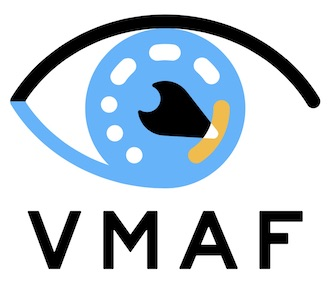

VMAF - Video Multi-Method Assessment Fusion
===================

  

VMAF is a perceptual video quality assessment algorithm developed by Netflix. VMAF Development Kit (VDK) is a software package that contains the VMAF algorithm implementation, as well as a set of tools that allows a user to train and test a custom VMAF model. Read [this](https://medium.com/netflix-techblog/toward-a-practical-perceptual-video-quality-metric-653f208b9652) techblog post for an overview, or [this](https://medium.com/netflix-techblog/vmaf-the-journey-continues-44b51ee9ed12) post for the latest updates and tips for best practices.

## News

- (7/13/20) We have created a [memo](https://docs.google.com/document/d/1dJczEhXO0MZjBSNyKmd3ARiCTdFVMNPBykH4_HMPoyY/edit?usp=sharing) to share our thoughts on VMAF's property in the presence of image enhancement operations, its impact on codec evaluation, and our solutions.
- (2/27/20) We have changed VMAF's license from Apache 2.0 to [BSD+Patent](https://opensource.org/licenses/BSDplusPatent), a more permissive license compared to Apache that also includes an express patent grant.
- (2/27/20) We made a few changes in a recent refactoring effort:
    * Migrated the build system from makefile to meson.
    * Restructured the code. 
    * Introduced a new release candidate API with the associated library `libvmaf_rc` and executable `vmaf_rc`, co-existing with the current `libvmaf` and `vmafossexec`, all under `libvmaf/build`. The new release candidate API is designed for better interoperability with encoding optimization. We will deprecate the old API on a future date.

## Frequently Asked Questions

Refer to the [FAQ](FAQ.md) page.

## Usages

The VDK package offers a number of ways for a user to interact with the VMAF algorithm implementations. The core feature extraction library is written in C. The rest scripting code including the classes for machine learning regression, training and testing VMAF models and etc., is written in Python. Besides, there is C++ an implementation partially replicating the logic in the regression classes, such that the VMAF prediction (excluding training) is fully implemented.

There are a number of ways one can use the package:

  - [VMAF Python library](resource/doc/VMAF_Python_library.md) offers full functionalities including running basic VMAF command line, running VMAF on a batch of video files, training and testing a VMAF model on video datasets, and visualization tools, etc.
  - [`vmafossexec` - a C++ executable](resource/doc/vmafossexec.md) offers running the prediction part of the algorithm in full, such that one can easily deploy VMAF in a production environment without needing to configure the Python dependencies. Additionally, `vmafossexec` offers a number of exclusive features, such as 1) speed optimization using multi-threading and skipping frames, 2) optionally computing PSNR, SSIM and MS-SSIM metrics in the output.
  - [`libvmaf` - a C library](libvmaf/README.md) offers an interface to incorporate VMAF into your C/C++ code.
  - VMAF is now included as a filter in [FFmpeg](http://ffmpeg.org/) and can be configured using: `./configure --enable-libvmaf`. See the [FFmpeg documentation](resource/doc/ffmpeg.md) for usage.
  - [VMAF Dockerfile](Dockerfile) generates a VMAF docker image from the [VMAF Python library](resource/doc/VMAF_Python_library.md). Refer to [this](resource/doc/docker.md) document for detailed usages.
  - Build VMAF on Windows: follow instructions on [this](resource/doc/BuildForWindows.md) page.

## Datasets

We also provide [two sample datasets](resource/doc/datasets.md) including the video files and the properly formatted dataset files in Python. They can be used as sample datasets to train and test custom VMAF models.

## Models

Besides the default VMAF model which predicts the quality of videos displayed on a 1080p HDTV in a living-room-like environment, VDK also includes a number of additional models, covering phone and 4KTV viewing conditions. Refer to the [models](resource/doc/models.md) page for more details.

## Confidence Interval

Since VDK v1.3.7 (June 2018), we have introduced a way to quantify the level of confidence that a VMAF prediction entails. Each VMAF prediction score now can come with a 95% confidence interval (CI), which quantifies the level of confidence that the prediction lies within the interval. Refer to the [VMAF confidence interval](resource/doc/conf_interval.md) page for more details.

## Matlab Functionality

Besides the Python/C/C++ part of the repository, we also introduced a number of algorithms that are implemented in Matlab. For example, users can calculate ST-RRED, ST-MAD, SpEED-QA, and BRISQUE. For more details, see the [Matlab Usage](resource/doc/matlab_usage.md) page for more details.

## Report of VMAF Bad Cases

Over time, we have received feedbacks on when VMAF's prediction does not reflect the expected perceptual quality of videos, either they are corner cases where VMAF fails to cover, or new application scenarios which VMAF was not initially intended for. In response to that, we have created the Google form to allow users to upload their video samples and describe the scenarios. The bad cases are valuable for improving future versions of VMAF. Users can opt in or out for sharing their sample videos publicly. Please submit the bad cases through [this link](https://docs.google.com/forms/d/e/1FAIpQLSdJntNoBuucMSiYoK3SDWoY1QN0yiFAi5LyEXuOyXEWJbQBtQ/viewform?usp=sf_link).

## References

Refer to the [references](resource/doc/references.md) page.

## External Resources

Refer to [this page](resource/doc/external_resource.md) for a list of 3rd-party tools built on top of VMAF.
